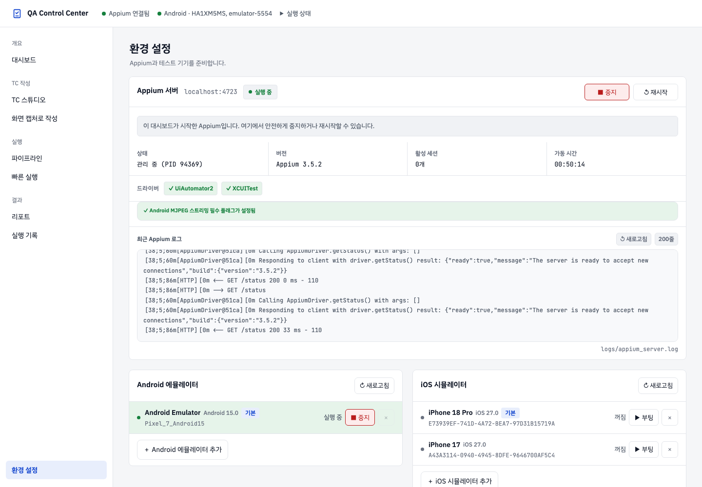
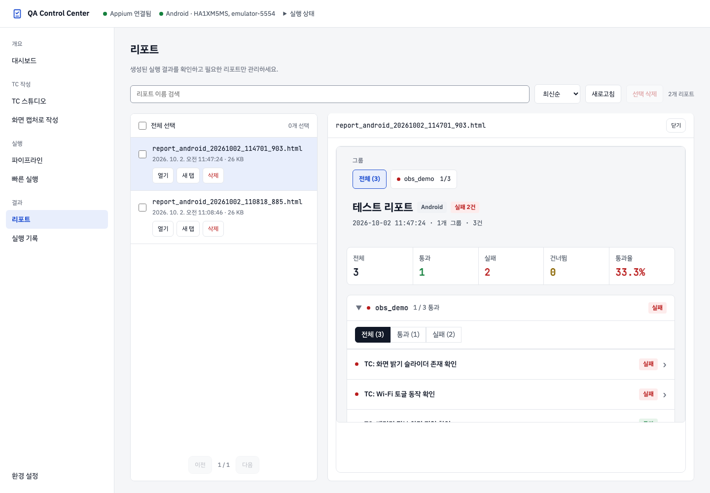

# QA Native App 온보딩

이 문서는 QA 팀원이 로컬 macOS에서 대시보드, Android 에뮬레이터, iOS 시뮬레이터를 준비하고 첫 테스트를 실행하는 절차입니다. 이 제품은 로컬 실행을 기준으로 하며, 대시보드와 Appium은 `127.0.0.1`에만 바인딩합니다.

## 1. 준비물

- macOS 13 이상
- Python 3.11 이상
- Node.js 18 이상
- Android Studio와 Android SDK
- iOS 테스트를 사용할 경우 Xcode와 iOS Simulator runtime
- 저장소 접근 권한

버전을 확인합니다.

```bash
python3 --version
node --version
npm --version
xcodebuild -version
```

Android SDK의 일반적인 위치는 `$HOME/Library/Android/sdk`입니다. 현재 셸에서 다음 경로를 사용할 수 있어야 합니다.

```bash
export ANDROID_HOME="$HOME/Library/Android/sdk"
export PATH="$PATH:$ANDROID_HOME/platform-tools:$ANDROID_HOME/emulator:$ANDROID_HOME/cmdline-tools/latest/bin"

adb --version
emulator -list-avds
```

필요하면 위 환경변수를 `~/.zshrc`에 추가한 뒤 새 터미널을 엽니다.

## 2. 프로젝트 설치

저장소 루트에서 가상환경과 Python 의존성을 설치합니다.

```bash
python3 -m venv .venv
source .venv/bin/activate
python -m pip install --upgrade pip
python -m pip install -r requirements.txt
```

Appium과 플랫폼 드라이버를 설치합니다.

```bash
npm install -g appium
appium driver install uiautomator2
appium driver install xcuitest

appium --version
appium driver list --installed
```

브라우저 기반 UI 회귀 테스트를 실행하려면 Chromium도 설치합니다.

```bash
playwright install chromium
```

## 3. 앱과 디바이스 설정

### 앱 설정

`config/test_data.json`에서 테스트할 앱을 지정합니다.

```json
{
  "app": {
    "android": {
      "package": "com.android.settings",
      "activity": ".Settings",
      "app_path": ""
    },
    "ios": {
      "bundle_id": "com.apple.Preferences",
      "app_path": ""
    }
  }
}
```

- 이미 설치된 앱은 Android `package`/`activity`, iOS `bundle_id`를 사용합니다.
- 앱 파일을 설치해야 하면 플랫폼별 `app_path`를 사용합니다.

### 디바이스 설정

권장 방법은 대시보드의 **환경 설정**에서 시스템 AVD 또는 Simulator를 검색해 추가하는 것입니다. 저장 결과는 `config/devices.json`에 반영됩니다.

기본 구조는 다음과 같습니다.

```json
{
  "android": {
    "emulator": [
      {
        "deviceName": "Android Emulator",
        "platformVersion": "15.0",
        "automationName": "UiAutomator2",
        "avd": "Pixel_7_Android15",
        "default": true
      }
    ],
    "real_device": []
  },
  "ios": {
    "simulator": [
      {
        "deviceName": "iPhone 16 Pro",
        "platformVersion": "18.0",
        "automationName": "XCUITest",
        "udid": "SIMULATOR-UDID",
        "default": true
      }
    ],
    "real_device": []
  }
}
```

- Android의 `avd`는 `emulator -list-avds`에 표시되는 이름과 같아야 합니다.
- iOS의 `udid`는 `xcrun simctl list devices available`에서 확인합니다.
- `default: true`는 각 종류에서 기본으로 선택할 기기를 뜻합니다.
- 실기기가 없어도 에뮬레이터와 시뮬레이터만으로 사용할 수 있습니다.
- 개인 실기기 UDID, Wi-Fi 주소, 계정 정보는 커밋하지 않습니다.

## 4. 대시보드 시작

```bash
source .venv/bin/activate
python agents/dashboard/serve.py
```

브라우저가 자동으로 열리지 않으면 <http://localhost:8767>에 접속합니다. 서버를 시작하면 이전 실행에서 기록된 프로세스 중 실제로 살아 있는 Appium·가상 기기 PID를 복원하고, 종료된 프로세스는 상태에서 제거합니다.

밝은 테마의 **QA Control Center**가 이 저장소의 앱 대시보드입니다. `8766`은 별도 웹 참고 저장소 포트입니다. 상단 파란 문서 체크 아이콘·제품 제목을 누르면 대시보드로 이동하고, **실행 상태**에서 추가 상태를 확인합니다. 실행은 **파이프라인** 또는 **빠른 실행** 화면에서 시작합니다.

사이드바 메뉴를 선택하면 화면 데이터가 갱신됩니다. 메뉴를 다시 누르는 방법으로도 최신 상태를 확인할 수 있으며, 새로고침과 브라우저 뒤로/앞으로 이동은 선택한 화면 주소를 유지합니다. 현재 화면 이미지와 주소는 [문서 안내](docs/README.md#현재-화면과-주소)에 모았습니다.

응답만 확인하려면 다른 터미널에서 실행합니다.

```bash
python3 - <<'PY'
import json
from urllib.request import urlopen

for path in ("/api/status", "/api/env/status"):
    with urlopen("http://127.0.0.1:8767" + path, timeout=5) as response:
        print(path, response.status, json.load(response))
PY
```

## 5. 환경 설정에서 실행 환경 준비

대시보드의 **환경 설정** 메뉴에서 다음 순서로 준비합니다.

1. Appium 카드를 열고 **시작**을 누릅니다.
2. Android 카드는 등록된 AVD를 시작하고 부팅 완료 상태를 확인합니다.
3. iOS 카드는 등록된 Simulator를 부팅하고 **실행 중** 상태를 확인합니다.
4. 목록에 기기가 없으면 **추가**에서 시스템에 설치된 AVD 또는 Simulator를 선택합니다.

Appium은 대시보드가 시작한 `managed` 상태와 사용자가 별도로 시작한 `external` 상태를 구분합니다. 에뮬레이터와 시뮬레이터는 Appium과 독립적으로 시작·중지할 수 있습니다.



터미널에서 Appium을 직접 실행해야 할 때만 다음 명령을 사용합니다.

```bash
appium --address 127.0.0.1 --port 4723 \
  --allow-insecure=uiautomator2:adb_screen_streaming
```

`adb_screen_streaming` 권한은 Android Capture Studio의 MJPEG 화면에 필요합니다. Appium을 `0.0.0.0`에 바인딩하면 같은 네트워크에서 디바이스 제어 API가 노출될 수 있으므로 사용하지 않습니다.

## 6. QA 작업 흐름

### Excel 테스트 케이스 가져오기

1. **TC 스튜디오 → 엑셀 가져오기**를 누릅니다.
2. 로컬 `.xlsx` 파일을 선택하거나 끌어다 놓습니다. 여러 파일을 선택할 수 있습니다.
3. 기준 양식을 자동 인식하거나 **다른 양식 직접 매핑**에서 열 문자·헤더 행을 지정합니다.
4. 스위트, 가져올 시트와 case ID 접두어를 지정하고 **변경 미리보기**에서 오류와 충돌을 확인합니다. 충돌마다 덮어쓰기 또는 제외를 선택합니다.
5. **가져오기**로 라이브러리에 반영합니다. 가져온 케이스는 승인·반려 대상에서 제외되므로 내용을 확인하고 **내보내기**에서 플랫폼·그룹·기존 파일 처리 정책을 선택합니다.

내보낸 결과는 `testcases/{platform}/{group}/tc_*.md`에 저장됩니다.

### 화면 캡처로 작성에서 TC 만들기

1. **화면 캡처로 작성**에서 플랫폼, 디바이스, 앱을 선택하고 **환경 확인** 후 세션을 시작합니다.
2. 화면 미러와 hierarchy에서 요소를 선택합니다.
3. tap, input, scroll, back, wait 동작을 기록합니다.
4. locator 후보의 점수(`n / 5`)와 안정성을 확인하고 **검증** 후 승인합니다.
5. **저장 및 생성**으로 pytest 파일을 생성합니다.

Android는 MJPEG 스트림을, iOS는 XCUITest 스크린샷 폴링을 사용합니다. 같은 플랫폼에서는 Capture Studio 세션과 테스트 실행을 동시에 사용하지 않습니다.

메뉴를 옮겨도 세션은 유지됩니다. 테스트를 실행하려면 Capture 화면의 **세션 종료**를 누릅니다. 30분 비활동 시 세션은 자동 비활성화되지만 기록은 보존됩니다. 드라이버가 끊긴 경우에는 **앱 재실행**으로 다시 연결합니다. 진행 표시는 **세션 설정 → 동작 기록 → Locator 검토 → 저장 및 생성**의 네 단계입니다.

### 빠른 실행

사이드바 **빠른 실행**에서 플랫폼, 연결된 기기 한 대, 테스트 폴더를 선택하고 **테스트 실행**을 누릅니다. 기기는 라디오 버튼으로 선택하며 미연결 기기는 비활성화됩니다.

- **자동 복구 건너뛰기**는 기본 체크 상태입니다.
- 체크 상태에서는 실패 TC도 한 번만 실행하고 멈춥니다.
- 필요할 때만 체크를 해제해 healing 흐름을 사용합니다.
- TC 결과는 전체·성공·실패 필터와 페이지 이동으로 확인합니다.

### 파이프라인

**파이프라인**에서 플랫폼, TC 폴더와 연결된 기기 한 대를 선택하고 **전체 실행**을 누릅니다. 분석, 코드 생성, lint, 실행, 필요 시 자동 복구를 순서대로 처리합니다. 실행 단계와 결과 화면은 빠른 실행과 같은 Android/iOS 관측성 구조를 사용합니다.

CLI가 필요한 경우 다음과 같이 실행합니다.

```bash
python scripts/01_analyze.py --platform android --mode emulator
python scripts/02_generate.py --platform android --strict-locators
python scripts/03_lint.py --platform android
python scripts/05_execute.py --platform android
```

iOS는 `--platform ios --mode simulator`를 사용합니다.

## 7. 실행 증거 확인과 보존

빠른 실행과 파이프라인 실행은 각 TC의 다음 자료를 수집합니다.

- 실행 영상
- Android logcat 또는 iOS simulator system log
- 마지막 화면 스크린샷
- 시도 횟수, 소요 시간, 결과가 포함된 manifest

실패 TC를 선택하면 영상 아래에서 시스템 로그를 검색·필터링하고 스크린샷을 확인할 수 있습니다. 결과 목록의 영상·로그·스크린샷 아이콘은 실제 산출물이 있는 경우에만 활성화됩니다.

기본 보존 정책은 `on_failure`입니다. 실행 화면의 **실패 시만** 라디오 버튼은 실패했거나 재시도가 발생한 TC의 증거를 남기며, **항상**을 선택하면 성공 증거도 보존합니다. 파일은 `state/runs/{run_id}/`에 저장됩니다.

### 저장된 리포트 확인

**리포트**에서 이름 검색과 정렬로 파일을 찾습니다. 왼쪽 목록의 체크박스는 삭제 대상을 선택하며 미리보기를 열지 않습니다. **열기** 또는 목록 행을 누르면 오른쪽 미리보기가 열립니다. **새 탭**은 독립 화면을 열고, **삭제**·**선택 삭제**는 확인 대화창 후 파일을 삭제합니다.

리포트 본문에는 그룹 선택, 제목, 전체 통계, 그룹별 필터와 TC가 순서대로 표시됩니다. 첫 그룹이 펼쳐지며 실패 TC에서 오류 요약·전체 오류·시도별 증거를 확인할 수 있습니다. 상단에는 대시보드 링크나 PDF 버튼이 없습니다. 좁은 화면에서는 목록과 미리보기가 세로로 배치됩니다.



**실행 기록**에서는 종류·그룹·플랫폼별 이력을 확인합니다. 이력은 브라우저 로컬 저장에 따라 달라집니다. 화면 캡처의 값은 촬영 시점의 실제 로컬 상태이며 사용 환경마다 달라집니다.

보존 한도를 바꾸려면 선택적으로 `config/observability.json`을 만듭니다.

```json
{
  "enabled": true,
  "keep": "on_failure",
  "retention": {
    "max_runs": 20,
    "max_total_mb": 2048
  }
}
```

한도를 넘으면 완료된 오래된 run부터 정리합니다. 최근 6시간 안에 시작됐고 아직 완료되지 않은 run은 장시간 실행일 수 있으므로 자동 정리에서 보호합니다.

## 8. Nova MCP 연결 (선택)

Claude Code에서 Capture Studio 세션을 제어하려면 `.claude/settings.json`에 서버를 등록합니다.

```json
{
  "mcpServers": {
    "qa-capture-studio": {
      "url": "http://localhost:8767/mcp"
    }
  }
}
```

Claude Code를 다시 시작하고 Capture Studio 세션을 연 뒤 screenshot, hierarchy, tap, scroll, input, back, screen info, TC 생성 도구를 사용할 수 있습니다. 활성 세션이 없으면 `session_not_active`가 반환됩니다.

## 9. 설치 및 코드 검증

Python 문법과 JSON 설정을 확인합니다.

```bash
source .venv/bin/activate
python -m py_compile \
  agents/dashboard/serve.py \
  agents/dashboard/shared.py \
  agents/dashboard/ws.py \
  agents/dashboard/routes/*.py \
  agents/dashboard/utils/*.py \
  scripts/*.py

python -m json.tool config/devices.json >/dev/null
python -m json.tool config/test_data.json >/dev/null
```

디바이스 없이 실행할 수 있는 전체 회귀 테스트는 다음과 같습니다.

```bash
pytest -q tests --ignore=tests/generated
```

`tests/generated/android/obs_demo`와 `tests/generated/ios/obs_demo`는 결과 화면과 증거 수집을 확인하기 위한 데모입니다. 각 플랫폼에 성공 1건과 의도적 실패 2건이 포함되어 있으므로 위 회귀 명령에서는 제외합니다.

실제 앱 E2E는 환경 설정에서 Appium과 대상 가상 기기를 실행한 뒤 `obs_demo` 또는 팀 테스트 폴더를 선택해 확인합니다. 실기기가 없어도 Android 에뮬레이터와 iOS 시뮬레이터 E2E는 가능합니다.

## 10. 런타임 파일

다음 경로는 실행 중 생성되며 소스 변경과 분리해서 다룹니다.

- `logs/`: Appium, 가상 기기, 테스트 실행 로그
- `state/runs/`: 영상·시스템 로그·스크린샷·manifest
- `state/captures/`: Capture Studio 세션 자료
- `state/running_procs.json`: 대시보드가 관리하는 프로세스 정보
- `tests/reports/`: 저장된 HTML 리포트 (`reports/screenshots/`는 예전 산출물의 호환 경로)

런타임 파일과 로컬 실기기 식별자는 코드 변경 커밋에 포함하지 않습니다.

## 11. 문제 해결

| 증상 | 확인할 내용 | 조치 |
|---|---|---|
| `Neither ANDROID_HOME nor ANDROID_SDK_ROOT` | Android SDK 경로 | `ANDROID_HOME`과 `PATH`를 다시 설정합니다. |
| Android 화면이 보이지 않음 | Appium 시작 옵션, 8093 포트 | Appium을 `adb_screen_streaming` 허용 옵션으로 재시작합니다. |
| 에뮬레이터가 `offline` | `adb devices`, 부팅 완료 값 | 환경 설정에서 중지 후 다시 시작하고 `adb shell getprop sys.boot_completed`가 `1`인지 확인합니다. |
| iOS 세션 생성이 오래 걸림 | 첫 WDA 빌드 | Xcode 라이선스와 runtime을 확인하고 첫 연결은 30초 이상 기다립니다. |
| iOS 세션 충돌 | 열린 XCUITest 세션 | 같은 Simulator의 Capture Studio 세션을 종료한 뒤 테스트를 실행합니다. |
| Appium이 비정상 종료됨 | 환경 설정 상태 | Appium 카드에서 다시 시작합니다. 상태 폴링이 종료된 PID를 제거합니다. |
| 대시보드 재시작 후 상태가 이상함 | 기록 PID와 실제 프로세스 | 대시보드를 다시 시작합니다. 살아 있는 PID만 복원됩니다. |
| 디스크 사용량 증가 | `state/runs/`와 보존 설정 | 보존 한도를 낮추거나 대시보드에서 필요 없는 run을 삭제합니다. |
| `collected 0 items` | 선택한 생성 테스트 폴더 | TC Studio에서 승인 TC를 Markdown으로 내보내거나 Capture Studio로 TC를 만든 뒤 다시 실행합니다. |

추가 사용법은 [README.md](README.md)와 [docs/guides/USER_GUIDE.html](docs/guides/USER_GUIDE.html)을 참고하세요.
