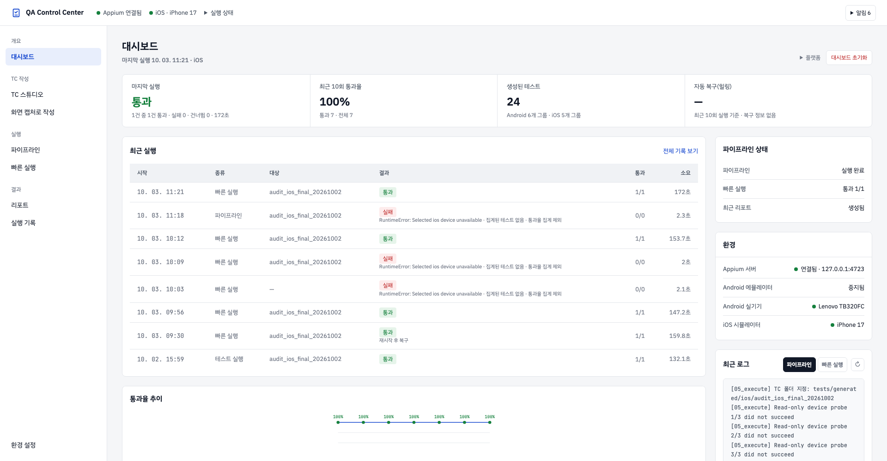

# QA Automation — Native App

Appium 기반 Android/iOS 앱 테스트 자동화 프로젝트입니다. native 화면을 기본으로 실행하고, 실제 WebView context가 감지된 화면만 Playwright DOM locator를 선택적으로 사용합니다.

## 테스트 파이프라인

```text
01_analyze → 02_generate → 03_lint → 05_execute → 06_heal
```

`06_heal`의 자동 실행은 측정된 실패가 모두 Locator 오류일 때만 허용합니다. 기대 결과 불일치·연결·설정 오류가 섞이면 중단합니다. 전체 실행은 대시보드의 단일 `파이프라인` 흐름이며, 별도의 단일/병렬 실행 유형을 제공하지 않습니다.

### 플랫폼

- Android: Appium UiAutomator2
- iOS: Appium XCUITest
- 실행 전 Appium 서버와 대상 에뮬레이터/시뮬레이터 또는 실제 디바이스가 준비되어야 합니다.
- 화면 분석 결과는 Android/iOS별로 분리해 `state/pipeline.json`에 저장합니다.

## 빠른 시작

### 설치

```bash
python3 -m venv .venv
source .venv/bin/activate
pip install -r requirements.txt
npm install -g appium
appium driver install uiautomator2
appium driver install xcuitest
```

`requirements.txt`에 `pytest-rerunfailures`가 설치되어 있어도 실행·복구 검증에서는 `-p no:rerunfailures`로 비활성화합니다. 실패한 테스트를 일괄 반복하지 않으며, 시작 전 기기·Appium 조회만 최대 3회 확인합니다.

Android는 `ANDROID_HOME`과 `adb`를 설정하고, iOS는 Xcode 및 `xcrun simctl`을 준비합니다.

```bash
export ANDROID_HOME="$HOME/Library/Android/sdk"
export PATH="$PATH:$ANDROID_HOME/platform-tools:$ANDROID_HOME/emulator"
```

### 설정

실제 앱에 맞게 다음 파일을 먼저 수정합니다.

- `config/test_data.json`: Android package/activity, iOS bundle ID/app path
- `config/devices.json`: Android emulator 또는 device, iOS simulator 또는 device capability
- `config/screens.json`: 분석 대상 화면과 화면 이동 action
- `config/locators.json`: native/WebView locator의 기준값
- `config/jira_config.json`: 이 제품 전용 Jira 프로젝트/이슈 설정

locator는 Appium용 `strategy`와 `value`를 유지하며 `surface`를 지정할 수 있습니다. `auto`는 native를 먼저 찾고 실패한 경우에만 실제 WebView context를 확인합니다.

```json
{
  "schema_version": 1,
  "targets": {
    "login.username_field": {
      "android": {"surface": "auto", "strategy": "ID", "value": "com.example:id/username", "webview": {"strategy": "label", "value": "아이디"}},
      "ios": {"strategy": "ACCESSIBILITY_ID", "value": "username"}
    }
  }
}
```

권장 locator 우선순위는 Android `ID`/accessibility, iOS `ACCESSIBILITY_ID`/predicate 또는 class chain, XPath는 마지막 수단입니다. Inspector에서 확인한 값을 registry에 저장한 뒤 코드를 생성합니다.

WebView가 없는 앱과 화면에서는 Playwright를 시작하지 않습니다. Android Chromium WebView를 Playwright로 제어하려면 CDP endpoint를 `PLAYWRIGHT_WEBVIEW_CDP_URL`에 설정합니다. CDP를 사용할 수 없는 iOS WKWebView 등의 환경은 Appium WebView context로 동일 locator를 실행합니다.

### Appium 서버 및 대시보드

```bash
ANDROID_HOME="$HOME/Library/Android/sdk" appium --address 127.0.0.1 --port 4723 \
  --allow-insecure=uiautomator2:adb_screen_streaming
.venv/bin/python agents/dashboard/serve.py
```

> ⚠️ `--address 127.0.0.1` 고정 필수. `0.0.0.0` 바인딩은 보안상 금지됩니다.  
> `--allow-insecure=uiautomator2:adb_screen_streaming` 없이 시작하면 Android MJPEG 미러링이 동작하지 않습니다.

브라우저에서 <http://localhost:8767>을 엽니다. 이 저장소의 앱 대시보드는 밝은 테마를 사용합니다. `8766`은 별도 웹 참고 저장소의 포트입니다.

상단의 파란 문서 체크 아이콘과 **QA Control Center** 제목을 누르면 대시보드로 이동합니다. 상단에는 Appium·기기 상태, **실행 상태** 펼치기 메뉴와 확인할 오류가 있을 때 표시되는 **알림**이 있고, 실행 버튼은 각 실행 화면에 있습니다.

사이드바에서 **대시보드**, **TC 스튜디오**, **화면 캡처로 작성**, **파이프라인**, **빠른 실행**, **리포트**, **실행 기록**, **환경 설정**을 선택합니다. 메뉴를 다시 누르면 해당 화면 데이터를 새로 확인하며, 화면 주소는 새로고침과 뒤로/앞으로 이동에도 유지됩니다. 대시보드에는 마지막 실행, 최근 10회 통과율, 최근 실행 목록과 추이, 환경 상태가 표시됩니다.



화면별 실제 캡처와 주소는 [문서 안내](docs/README.md#현재-화면과-주소), 자세한 조작은 [사용자 가이드](docs/guides/USER_GUIDE.html)를 참고하세요. 캡처의 실행 결과와 기기명은 촬영 시점의 실제 로컬 상태이며 사용 환경마다 달라집니다.

### TC 스튜디오에서 Excel 가져오기

`/tc-studio`에서 **엑셀 가져오기**를 누르고 로컬 `.xlsx` 파일을 선택하거나 끌어다 놓습니다. 여러 파일을 선택할 수 있으며 파일당 최대 25MB입니다. 라이브러리로 가져온 케이스는 가져오기 상태로 관리되고 검토 승인·반려 대상에서는 제외됩니다. 내용을 확인한 뒤 **내보내기**에서 Markdown을 생성합니다.

현재 Markdown 테스트 케이스를 Excel로 다시 만들려면 다음 명령을 사용합니다.

```bash
python scripts/export_testcases_excel.py
```

기본 결과는 `import/qa_native_app_testcases.xlsx`이며 `전체`, `android`, `ios` 시트를 포함합니다.

```text
파일 선택 → 양식 인식·열 매핑 → 시트·스위트 지정 → 변경 미리보기 → 가져오기
```

- 기준 양식을 자동 인식하거나 **다른 양식 직접 매핑**에서 열 문자와 헤더 행을 지정합니다. 매핑 프로필을 저장해 재사용할 수 있습니다.
- 가져올 시트와 case ID 접두어, 대상 스위트를 지정합니다. 시트마다 다른 매핑 프로필도 적용할 수 있습니다.
- **변경 미리보기**에서 신규·갱신·동일·충돌·오류를 확인합니다. 충돌 행마다 덮어쓰기 또는 제외를 선택한 뒤 **가져오기**를 누릅니다.
- Android/iOS 결과는 라이브러리에서 각각 관리합니다. 내보내기에서 플랫폼과 그룹을 지정하고 Markdown 변경을 미리 확인합니다. 기존 파일은 `skip-conflict`(기본값) 또는 `overwrite` 정책으로 처리합니다.
- 원본 Excel 파일은 변경하지 않습니다.

```text
로컬 {파일}.xlsx → TC 스튜디오 라이브러리 → 내용 확인·내보내기
  ├─ Android → testcases/android/{그룹}/tc_*.md
  └─ iOS     → testcases/ios/{그룹}/tc_*.md

testcases/android/{그룹}/ → tests/generated/android/{그룹}/
testcases/ios/{그룹}/     → tests/generated/ios/{그룹}/
```

Markdown 파일 이름은 그룹 매핑의 접두어로 매긴 TC ID(`tc_{ID}_{제목}.md`)라 같은 그룹 안에서 겹치지 않고, 기존 파일과 겹치면 미리보기에서 충돌로 표시됩니다. 빠른 실행은 선택한 OS의 `tests/generated/{platform}`만 조회합니다.

### TC 스튜디오 초안 생성 준비

기획 정보로 초안을 만들려면 대시보드를 실행하는 계정에서 Claude Code CLI(`claude`)가 설치·로그인되어 있어야 합니다. 대시보드는 `claude -p`를 별도 프로세스로 호출하며 LLM SDK를 쓰지 않습니다.

```bash
claude -p "hi"                                   # 로그인 확인
TCS_CLAUDE_MODEL=claude-opus-5-5 .venv/bin/python agents/dashboard/serve.py   # 모델 고정(선택)
```

| 환경 변수 | 뜻 | 기본값 |
|---|---|---|
| `TCS_CLAUDE_MODEL` | 초안 생성 모델 | 비우면 `claude` CLI 기본 모델 |
| `TCS_CLAUDE_BIN` | `claude` 실행 파일 경로 | `PATH`에서 찾음 |
| `TCS_CHUNK_TIMEOUT` | 기획 정보 묶음 1개당 제한 시간(초) | `300` |

Confluence·Figma 토큰은 TC 스튜디오의 **연결 설정**에서 입력하며 이 컴퓨터에만 저장됩니다.

### 환경 설정

대시보드 **환경 설정** 메뉴에서 Appium 서버와 에뮬레이터/시뮬레이터를 터미널 없이 관리합니다.

```text
Appium 카드  — 시작·중지·재시작. managed(대시보드 관리) / external(외부 실행) 모두 중지 가능
Android 카드 — AVD 목록 · 부팅 · 중지 · 기기 추가/삭제
iOS 카드     — 시뮬레이터 목록 · 부팅(비동기) · 종료 · 기기 추가/삭제
```

- Appium 상태: `stopped` / `starting` / `managed` / `external` / `error`
- `external` 상태에서도 대시보드 중지 버튼으로 종료 가능 (포트 기반 PID 탐색 후 SIGTERM)
- 에뮬레이터/시뮬레이터는 Appium과 독립적으로 시작·종료 가능
- 최소 보유 정책: 가상 기기(에뮬레이터/시뮬레이터) 최소 1대 유지 (삭제 시 disabled), 실기기 0대 허용
- 화면 캡처 iOS 세션 활성 중 시뮬레이터 종료 차단 (Android 세션과 독립)
- 자세한 조작: [사용자 가이드](docs/guides/USER_GUIDE.html)

### 화면 캡처로 작성

대시보드의 **화면 캡처로 작성** 메뉴에서 실제 앱 화면을 보면서 요소를 선택하고 TC를 직접 생성합니다.

```text
1. 세션 설정   — OS(Android/iOS) · 디바이스 · 앱 설정 후 환경 확인·세션 시작
2. 동작 기록   — 화면 미러·hierarchy에서 Tap/Input/Scroll/Back/Wait 실제 조작 기록
3. Locator 검토 — 후보 점수(n / 5)·안정성 확인, 검증 및 승인
4. 저장 및 생성 — 미리보기 확인 후 자체 완결형 pytest 파일 생성
```

**Capture 실행 대상 정책:** 에뮬레이터·시뮬레이터 선택을 실기기로 자동 대체하지 않습니다. 선택한 종류의 기기가 준비되지 않으면 환경 설정에서 가상 기기를 시작하거나 실기기 연결을 확인한 뒤 **환경 확인**을 다시 합니다. 대상 변경은 사용자가 직접 선택하며, 세션 동안 앱 실행·미러링·재연결은 같은 기기 ID를 사용합니다.

#### 주요 기능

- Android MJPEG 화면 미러링 (포트 8093)
- iOS XCUITest 스크린샷 폴링 (1.2초), WDA 안정화 30초 여유
- hierarchy 트리 렌더링·노드 선택, 화면 전환 자동 감지 (4초 폴링, 쿨다운 3초)
- 동작 기록: tap / scroll / back / wait / input
- Locator 후보 및 승인 (Android: resource-id > content-desc > text, iOS: label > name > predicate)
- `저장 및 생성` → `_build_driver()` + `_el()` + `_ios_tap()` 포함 자체 완결형 pytest 생성
- Healing 연계: 실패 TC에서 Locator 검토(현재 진행 표시의 3단계) 재진입
- 세션 재연결 버튼 (`csReLaunch()`)
- **Nova MCP**: `routes/mcp.py` — HTTP+SSE MCP 서버, 툴 9종 (`screenshot`, `hierarchy`, `device_tap`, `scroll`, `input_text`, `back`, `screen_info`, `generate_test_case`, `clear_actions`). Claude Code에서 MCP 툴 호출 시 자동 연결, 대시보드 MCP ON/OFF 칩으로 상태 확인·수동 해제.
- **Livetail**: 화면 캡처 세션 없이도 접근 가능. user·mcp·pipeline 소스 필터, 200행 버퍼. 파이프라인 단계 시작·완료 이벤트 실시간 표시
- **TC 생성 소스 선택**: `source_filter` 파라미터(`all`|`user`|`mcp`)로 TC에 포함할 액션 출처 지정. 비실행 타입(`screenshot`·`hierarchy` 등) 자동 제거, 생성 TC docstring에 출처·액션 수 표기

**제약사항:**
- Android MJPEG: Appium `--allow-insecure=uiautomator2:adb_screen_streaming` 필수, 포트 8093 개방 필요
- iOS: 시뮬레이터당 XCUITest 세션 1개 — 화면 캡처 iOS 세션과 파이프라인 iOS TC 동시 실행 불가
- 플랫폼에 관계없이 활성 Capture 세션과 테스트·파이프라인 실행은 동시에 사용할 수 없습니다. 빠른 실행·개별 단계·전체 실행도 한 작업씩 진행합니다.
- 메뉴 이동은 Capture 세션을 종료하지 않습니다. 테스트 실행 전 **세션 종료**를 누릅니다. 30분 비활동 시 자동 비활성화되며 기록은 보존됩니다. 드라이버 연결이 끊기면 작성 내용을 유지하고 안내에 따라 **세션 재연결**을 사용합니다. 설정 화면에서는 **앱 재실행**으로 표시될 수 있습니다.

생성된 pytest 파일은 자체 완결형(`_build_driver()` + `_el()` + class 구조 포함)으로, 수정 없이 `05_execute.py`로 바로 실행할 수 있습니다.

### 실행 증거와 결과 확인

빠른 실행과 파이프라인 실행은 Android/iOS에서 같은 결과 화면을 사용합니다. TC 목록은 전체·성공·실패로 필터링하고 페이지 단위로 확인할 수 있으며, 실패 TC를 선택하면 해당 시도의 영상, 시스템 로그, 스크린샷을 한 화면에서 확인할 수 있습니다.

- 기본 보존 정책은 실패 또는 재시도가 발생한 TC만 보존하는 `on_failure`입니다.
- `always`를 선택하면 성공 TC의 증거도 보존합니다.
- 실행 증거는 `state/runs/{run_id}/`에 저장됩니다.
- 보존 한도 기본값은 최근 20개 run, 전체 2GB입니다. HTML 리포트가 없는 실패 기록도 실행 시각으로 정리하며, 시작 후 6시간 이내의 실행 중 기록은 보호합니다. `config/observability.json`의 `retention.max_runs`, `retention.max_total_mb`로 조정할 수 있습니다.
- 빠른 실행의 **자동 복구 건너뛰기**는 기본 체크 상태입니다. 해제해도 Locator 오류만 복구하며 최신 화면 수집·복구 검증에 성공해야 후속 실행합니다. 연결·설정·검증 오류와 중단·시간 초과는 자동 반복하지 않습니다.
- 파이프라인과 빠른 실행에서는 선택한 플랫폼의 연결된 기기 한 대를 라디오 버튼으로 선택합니다. 미연결 기기는 선택할 수 없습니다. 보존 정책도 **실패 시만** 또는 **항상** 중 하나를 라디오 버튼으로 선택합니다. 실패 시만은 실패·재시도 증거를 보존합니다.

### 리포트와 실행 기록

**리포트**에서 이름 검색·정렬로 파일을 찾습니다. 왼쪽 목록의 체크박스는 삭제 대상을 선택하며 미리보기를 열지 않습니다. **열기** 또는 목록 행을 눌러 오른쪽 미리보기에서 확인하고, **새 탭**으로 독립 화면을 엽니다. **삭제**와 **선택 삭제**는 확인 후 파일을 삭제합니다. 아무것도 선택하지 않으면 선택 삭제가 비활성화됩니다.

리포트 본문은 그룹 선택 → 제목과 실행 정보 → 전체 통계 → 그룹별 필터와 TC 순서입니다. 첫 그룹은 펼쳐져 있으며, 실패 TC를 열면 오류 요약·전체 오류와 보존된 시도별 증거를 확인합니다. 본문 상단에는 대시보드 링크나 PDF 버튼이 없습니다. 목록은 380px, 미리보기는 남은 폭을 사용하며 좁은 화면에서는 세로로 배치됩니다. 기존 QA 리포트는 대시보드에서 열 때 현재 표시 스타일을 적용하고 원본 파일·증거는 유지합니다.

**실행 기록**에서는 서버에 저장된 실행별 결과·리포트·증거를 바탕으로 최근 50건을 확인합니다. 종류는 시작 경로에 따라 **빠른 실행 / 파이프라인**으로 표시하며 파이프라인 개별 단계도 포함합니다. 경로를 확인할 수 없는 과거 기록·별도 CLI 실행은 **테스트 실행**으로 표시합니다. 테스트 시작 전 실패해 HTML 리포트가 없는 실행도 표시합니다. 같은 서버에 접속한 브라우저는 같은 기록을 봅니다. 기록 초기화는 모든 브라우저에 적용되며 리포트·증거 파일은 삭제하지 않습니다.

### 실행 중단·오류 대응

- 취소 후에는 프로세스 종료가 확인될 때까지 새 실행을 막습니다. 브라우저를 닫거나 메뉴를 옮기는 것은 실행 취소가 아닙니다.
- 서버 재시작 후 살아 있는 실행은 다시 추적합니다. 복원할 수 없는 작업은 중단 상태로 남기며 남은 단계를 자동으로 이어서 실행하지 않습니다.
- 실행 단계의 기본 제한 시간은 30분입니다. 필요한 경우 `QA_STAGE_TIMEOUT_SECONDS`로 조정합니다.
- Capture의 화면·Hierarchy 읽기는 같은 드라이버와 기기에서 알려진 일시적 통신 오류만 최대 2회 조회합니다. 탭·입력·스크롤·뒤로가기·세션 생성은 자동 재전송하지 않습니다.
- 상단 **알림**에서 대상·시각·원인과 대응 버튼을 확인합니다. **확인했어요**는 현재 브라우저에서 알림을 숨기며 실행 결과를 삭제하지 않습니다.
- 자동 복구는 이번에 새로 수집한 화면만 사용합니다. 수집·복구 검증이 실패하면 해당 시도의 변경을 되돌리고 추가 자동 실행을 멈춥니다.

자세한 절차는 [사용자 가이드의 오류별 대응](docs/guides/USER_GUIDE.html#error-retry-notices)과 [재시작·시간 초과 대응](docs/guides/USER_GUIDE.html#pipeline-restart-timeout)을 참고하세요.

### CLI 실행

```bash
# Android
python scripts/01_analyze.py --platform android --mode emulator
python scripts/02_generate.py --platform android --strict-locators
python scripts/03_lint.py --platform android
python scripts/05_execute.py --platform android

# iOS
python scripts/01_analyze.py --platform ios --mode simulator
python scripts/02_generate.py --platform ios --strict-locators
python scripts/03_lint.py --platform ios
python scripts/05_execute.py --platform ios
```

`--strict-locators`는 `config/locators.json`에 등록되지 않은 대상의 생성을 중단해 placeholder 코드 생성을 막습니다.

## Jira 실패 보고

대시보드 전체 파이프라인이 Locator 오류로 허용된 자동 복구·후속 실행을 최대 3회 진행한 뒤에도 실패하면 `scripts/jira_reporter.py`가 이 제품의 `config/jira_config.json`을 사용해 Jira Bug를 생성합니다. 실패 스크린샷과 최종 실패 영상도 자동 첨부합니다. Jira 설정이 비활성화되었거나 토큰이 없으면 Jira만 건너뛰고 테스트 결과는 유지합니다. 환경·검증 오류나 복구 검증 실패로 더 일찍 중단한 작업은 이 자동 보고 경로에 도달하지 않을 수 있습니다.

```bash
export JIRA_TOKEN="<Atlassian API token>"
```

Jira 설정은 `qa-native-fixed`와 공유하지 않습니다. URL, 이메일, 프로젝트 키, 이슈 타입, 에픽, 버전은 이 프로젝트의 `config/jira_config.json`에서 별도로 관리하고, 토큰은 환경변수로만 주입합니다.

## 테스트 케이스와 locator 흐름

테스트 케이스는 `testcases/{platform}/{group}/tc_*.md`에 작성합니다. `{platform}`은 `android` 또는 `ios`이고, TC Studio에서 `{group}`을 정해 내보냅니다. 최종 실행 locator의 기준값은 `config/locators.json`에서 관리합니다.

```text
TC Markdown → target_ref + config/locators.json
            → Android/iOS AppiumBy 코드 생성
            → 실패 시 최신 page_source 수집
            → 유일 후보만 registry 갱신
```

DOM을 모르는 상태에서 locator를 추측해 코드를 확정하지 않습니다. `01_analyze.py`는 native XML과 감지된 WebView DOM을 분리해 저장하고, `06_heal.py`도 locator의 surface 안에서만 후보를 찾습니다. 후보가 여러 개이거나 최신 화면을 확인할 수 없으면 자동 변경하지 않습니다. 실패 시 **화면 캡처로 작성**에서 요소의 Locator 후보를 검증하고 승인한 뒤 다시 생성합니다.

## 주요 파일

| 경로 | 역할 |
|---|---|
| `agents/dashboard/serve.py` | FastAPI 앱 구성과 대시보드 서버 진입점 |
| `agents/dashboard/dashboard.html` | 대시보드 문서 구조와 화면 컨테이너 |
| `agents/dashboard/static/dashboard.css` | 대시보드 공통 스타일 |
| `agents/dashboard/static/*.js` | 환경 설정, 실행, 관측성, 화면 캡처, 리포트 UI 모듈 |
| `agents/dashboard/routes/*.py` | 환경·실행·Capture·관측성·MCP API 라우트 |
| `agents/dashboard/utils/*.py` | 디바이스, 프로세스, 코드 생성, 증거 보존 공통 서비스 |
| `agents/dashboard/routes/mcp.py` | Nova MCP HTTP+SSE 서버 (JSON-RPC 2.0, 툴 9종) |
| `scripts/import_excel.py` | TC Markdown 렌더러 (TC 스튜디오 내보내기 형식) |
| `scripts/01_analyze.py` | Appium native UI hierarchy 수집 |
| `scripts/02_generate.py` | TC Markdown → pytest 코드 생성 |
| `scripts/03_lint.py` | 생성 코드 lint 검사 |
| `scripts/05_execute.py` | pytest/Appium 실행과 리포트 생성 |
| `scripts/06_heal.py` | 최신 수집 화면을 이용한 Locator 복구와 검증 실패 시 변경 복원 |
| `scripts/error_policy.py` | 오류 원인 분류·사용자 대응 문구·자동 복구 허용 기준 |
| `scripts/locator_registry.py` | locator 정규화·registry·후보 탐색 공통 모듈 |
| `config/locators.json` | 플랫폼별 locator source of truth |
| `state/pipeline.json` | 단계별 상태와 UI hierarchy snapshot |
| `docs/guides/USER_GUIDE.html` | 현재 화면 기준 사용자 가이드 |
| `docs/images/user-guide/README.md` | 현재 제품 화면과 촬영 기준 |
| `agents/lessons_learned.md` | 운영 중 발견된 패턴과 교훈 (Appium 환경변수, iOS 부팅 방식 등) |

전체 문서 목록과 폴더별 안내는 [docs/README.md](docs/README.md)를 참고하세요.

## 산출물 및 제한사항

- 산출물: `tests/generated/`, `tests/reports/`, `state/pipeline.json`, `state/runs/`, `logs/run_*.txt`, `agents/lessons_learned.md`
- API·UI 계약, 증거 manifest, 보존 정책, 프로세스 복구는 디바이스 없이 회귀 테스트할 수 있습니다. 실제 앱 조작을 포함한 end-to-end 실행에는 Appium과 에뮬레이터·시뮬레이터 또는 실기기가 필요합니다.
- 후보가 여러 개이거나 snapshot이 없으면 자동 healing하지 않고 실패 원인을 남깁니다.
- GUI Appium Inspector를 매 실행마다 조작하지는 않지만, 같은 native hierarchy를 Appium `page_source`로 자동 수집합니다.

## 개발 검증

제품 코드의 회귀 테스트는 의도적으로 성공·실패가 섞인 생성형 데모 TC를 제외하고 실행합니다.

```bash
source .venv/bin/activate
pytest -q tests --ignore=tests/generated
```

`tests/generated/android/obs_demo`와 `tests/generated/ios/obs_demo`는 결과 UI와 증거 수집을 확인하기 위한 데모로, 각 플랫폼에 성공 1건과 의도적 실패 2건이 포함되어 있습니다.
